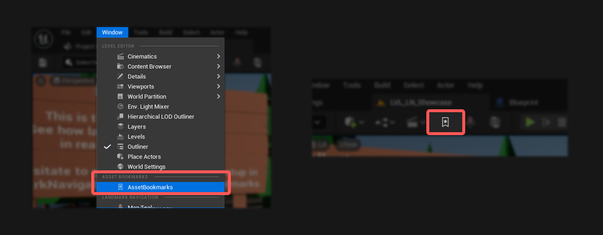

# Overview

 

 

Asset Bookmarks is an Unreal Engine plugin that allows you to quickly add and manage bookmarked assets.  

As projects grow, navigating the Content Browser becomes increasingly cumbersome. With **Asset Bookmarks**, you can simply drag and drop assets into the interface to keep them a click away. From there, you can open the assets, find them in the content browser or remove the bookmarks. 

The plugin also integrates with Unreal Engine’s built-in systems to display your **Recently Opened** and **Favorited levels** alongside your custom bookmarks.

 
#### Features
* **Drag & Drop:** Simply pull any asset from the Content Browser into the window to bookmark it.
* **Recent and Favorite Levels:** Uses Unreal Engine's built-in systems to show recently opened and favourited levels alongside your bookmarks.
* **List and Grid Views:** Choose the layout that best fits your workspace.
* **Context menu:** Right-clicking a bookmark provides quick actions:
	* Open Asset: Opens the editor for this asset
	* Show in Content Browser: Brings the content browser forward and navigate to the asset
	* Remove from Bookmarks: Simply removes this asset from the bookmarks 

***

## How to open

There are two ways to open the Asset Bookmark interface:

- Open Asset Bookmarks via the toolbar icon (can be disabled in settings).
- Navigate to Window -> Asset Bookmarks in the editor (can be disabled in settings).

***
