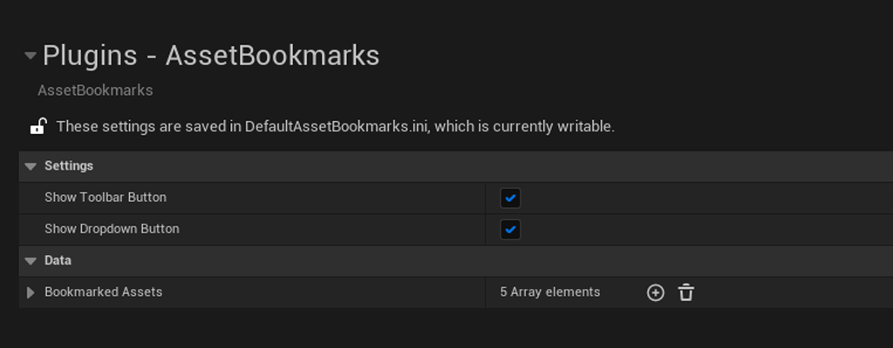

# Settings
 

The settings in Asset Bookmarks are about as simple as it can get. You will find them in `Project Settings -> Asset Bookmarks`, and are saved in `Project/Config/DefaultAssetBookmarks.ini`.

 

  

 

| Name                | Description                                                                                                |
| ------------------- | ---------------------------------------------------------------------------------------------------------- |
| Show Toolbar Button | If true, a button to open Asset Bookmarks will be created in the toolbar. (Restart Required)               |
| ShowDropdownButton  | If true, a button to open Asset Bookmarks will be created in the Windows dropdown menu. (Restart Required) |
| BookmarkedAssets    | List of all bookmarked assets.                                                                             |
