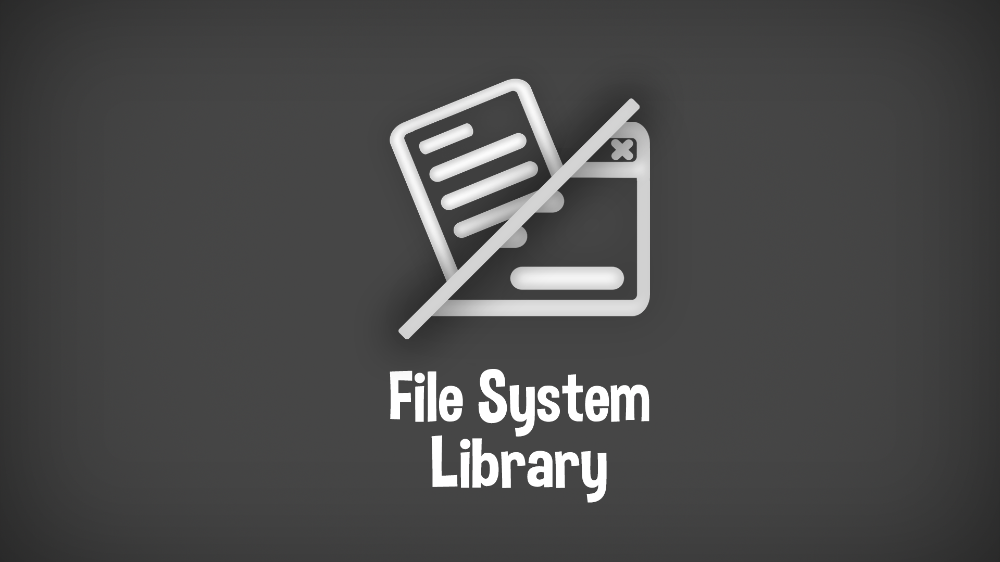
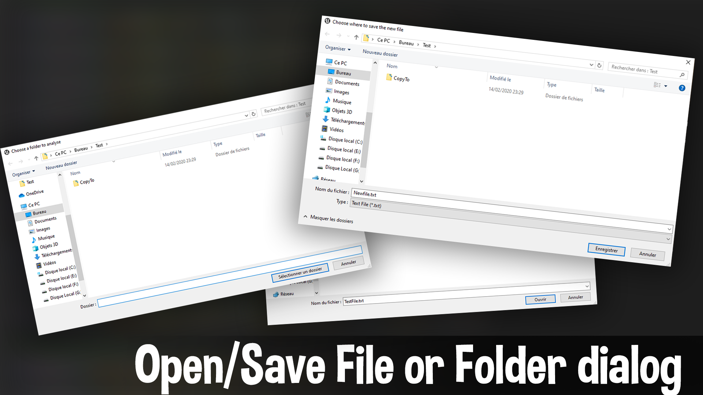
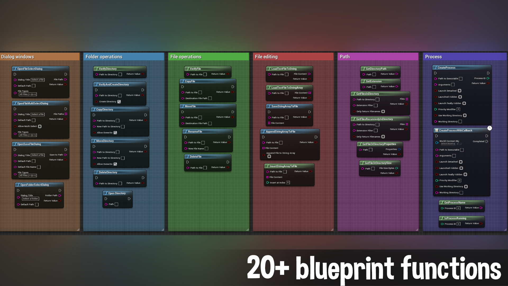
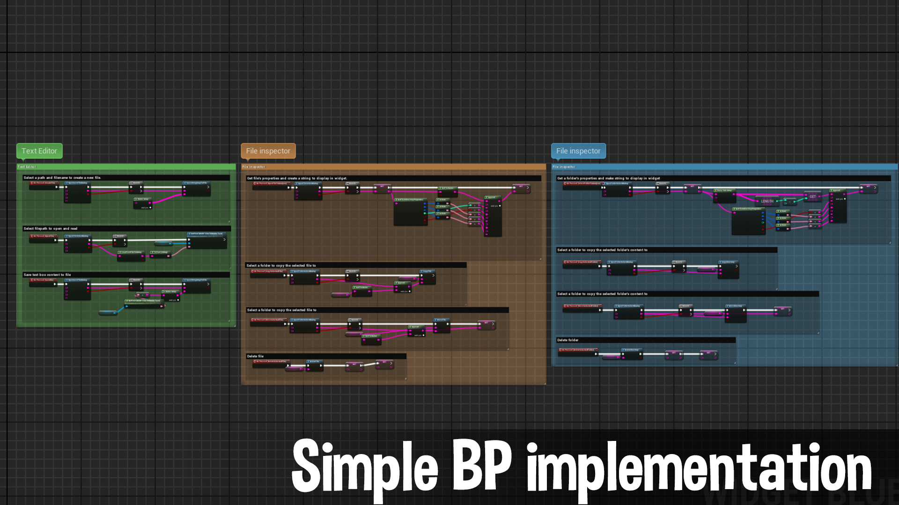

# File System Library
 

***

Description
:  Open, Save, Copy, Move and delete files and directories in tranquillity!

Supported Version
: 
[4.20](){: .btn .btn-green}
[4.21](){: .btn .btn-green}
[4.22](){: .btn .btn-green}
[4.23](){: .btn .btn-green}
[4.24](){: .btn .btn-green}
[4.25](){: .btn .btn-green}
[4.26](){: .btn .btn-green}
[4.27](){: .btn .btn-green}
[5.0](){: .btn .btn-green}
[5.1](){: .btn .btn-green}
[5.2](){: .btn .btn-green}
[5.3](){: .btn .btn-green}
[5.4](){: .btn .btn-green}
[5.5](){: .btn .btn-green}
[5.6](){: .btn .btn-red}

Github
: [https://github.com/Lambda-W/FileSystemLibrary](https://github.com/Lambda-W/FileSystemLibrary){:target="_blank"}

Fab Marketplace
:  [https://www.fab.com/listings/ec8e92ff-074b-4246-8fd1-e7f2c8510d76](https://www.fab.com/listings/ec8e92ff-074b-4246-8fd1-e7f2c8510d76){:target="_blank"}

Discord
: [https://discord.com/invite/bxgtNY8](https://discord.com/invite/bxgtNY8){:target="_blank"}

***

