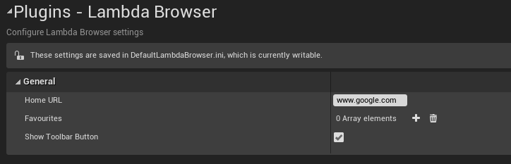

# Editor Browser
{: .no_toc }
 

Lambda Web Browser allows you to browse the web from a tab in the editor. You can access it by clicking the Web Browser button in the toolbar or via the Window dropdown menu.

* * *

## Settings

You can access the plugin’s settings by finding the Lambda Browser category in the project settings. Note that these only apply to the editor browser. You will find some settings to customise the editor browser:

  
- **HomeURL:** The URL to load when the browser is opened or the home button is pressed.
- **ShowToolbarButton:** Whether or not to show the toolbar button (requires a restart)
- **Favourites:** This shows the URL you have added to your favourites.

* * *

## Features

### Favourites

When using the editor browser, favourites are saved to the plugin’s settings (in `[Project Name] / Config / DefaultLambdaBrowser.ini` ). You can edit, [export or import](https://docs.unrealengine.com/en-US/Basics/UI/ProjectSettings/index.html) them to other projects via the Project Settings under the Lambda Browser category.

### History

The browser’s history is wiped every time the browser tab closes. This also means the history is wiped when shutting down the editor. 

### Cache/Cookies

All cache and cookies are saved in `[Project Name] / Saved / webcache`. You can delete them via the browser’s Clear Cache button or by deleting the webcache folder (you will have to close the editor to delete this folder).**
