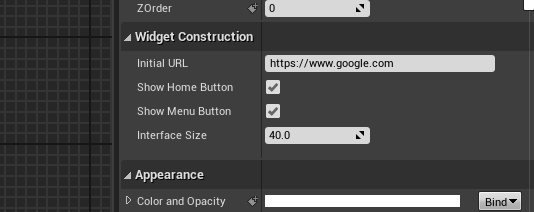
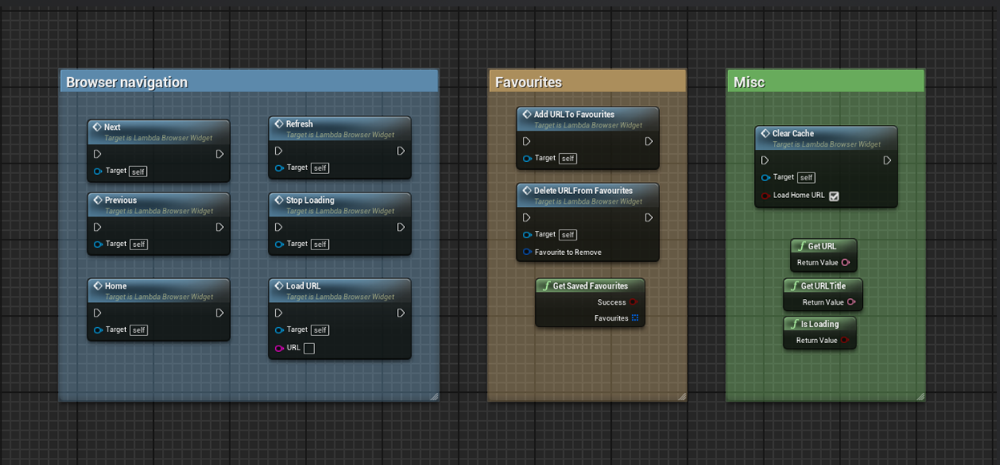

# Runtime Browser
{: .no_toc }
 

Lambda Web Browser comes with two browser widgets you can use in your games:

- **LambdaWebBrowser:** A widget class you can add to existing widgets. It is just a browser with no interface. Similar to Epic’s WebBrowser widget with added functionality. Useful if you want to make your own browser UI.  
- **LambdaWebBrowserWidget:** The same browser but with a scalable interface & favourites management. Useful if you want to get something going quickly!  

* * *

## Settings

If you are using the `LambdaWebBrowserWidget` class, you will have access to some settings: 

- **InitialURL:** The URL to load when loading the browser or pressing the Home button.
- **ShowHomeButton:** Whether or not to show the home button in the interface.
- **ShowMenuButton:** Whether or not to show the menu button in the interface.
- **InterfaceSize:** Scale of the interface, useful for scaling on mobile platforms.
  

If you are using the `LambdaWebBrowser` class, you will only have access to the InitialURL setting.

* * *

## Favourites, history and cache  

If you are using the `LambdaWebBrowserWidget` class, favourites are automatically managed and will be saved as a .sav file in the project’s save folder (in `[Project Name] / Saved / SaveGame / WebBrowserFavourites.sav`). If you are using the LambdaWebBrowser class, you will have to implement your own logic. 

History and cache works the same as the Editor browser see [here](EditorBrowser) .

* * *

## Blueprint API

Regardless of which widget class you are using you can use a multitude of blueprint accessible functions. However, if you wish to add some custom logic to the browser we’d recommend creating your own widget and adding the LambdaWebBrowser class to it.  

All functions are pretty self-explanatory and have a tooltip describing what they do (shown when hovering a node with the mouse).

  
* * *

## GetSource HTML

You can use the GetSource() function to get a string containing the html code of the currently loaded page. Please note that the source code won’t be returned until the page has finished loaded (hence it requires a delegate). The formatting of the HTML string is however not preserved.  

The source code can also be saved to a .txt or .html file by using the SaveStringToFile function as shown in the following screenshot.
