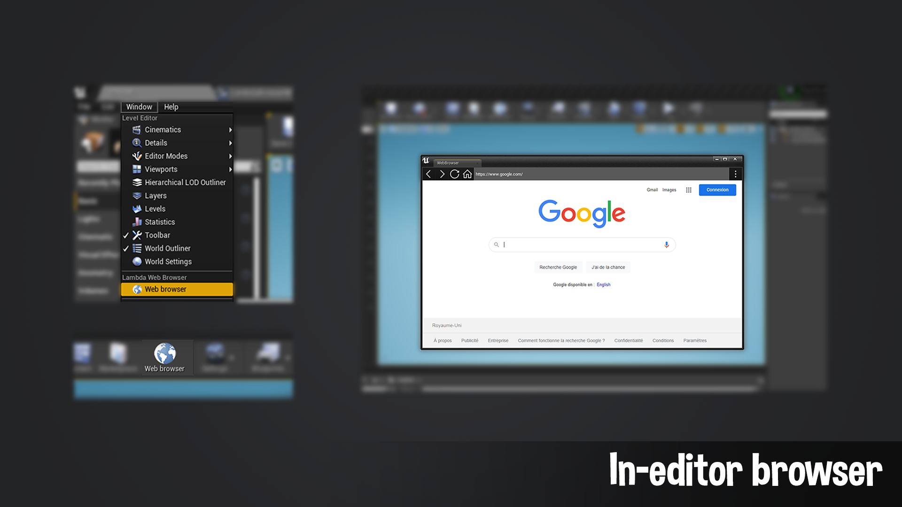
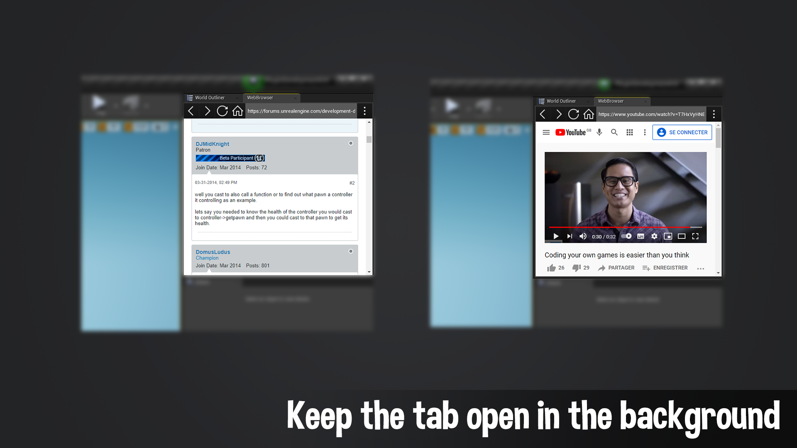
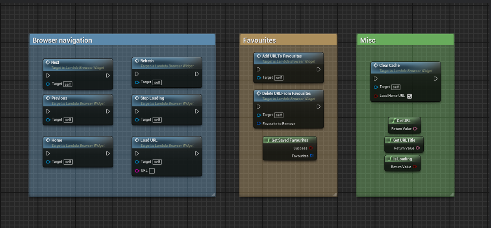
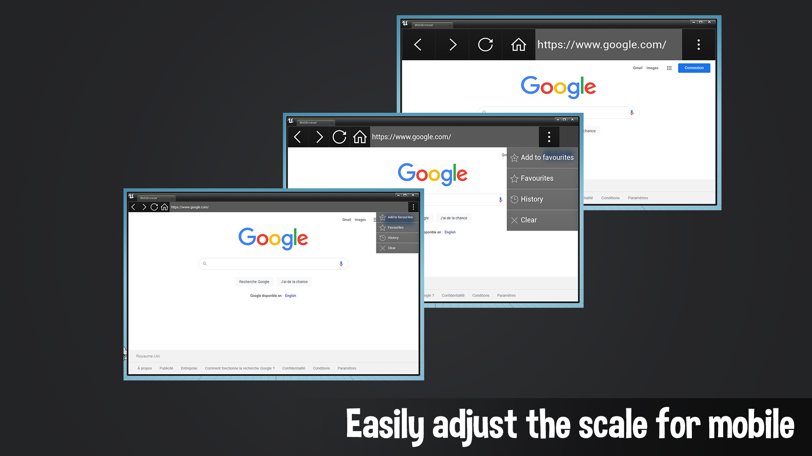

# Lambda Web Browser
 

***

Description
:  Navigate the web in-game or in editor!

Supported Version
: 
[4.25](){: .btn .btn-green}
[4.26](){: .btn .btn-green}
[4.27](){: .btn .btn-green}
[5.0](){: .btn .btn-green}
[5.1](){: .btn .btn-green}
[5.2](){: .btn .btn-green}
[5.3](){: .btn .btn-green}
[5.4](){: .btn .btn-green}
[5.5](){: .btn .btn-green}
[5.6](){: .btn .btn-red}

Fab Marketplace
:  [https://www.fab.com/listings/d9ea4b3b-3a2f-4d37-aae9-364ca08d56c7](https://www.fab.com/listings/d9ea4b3b-3a2f-4d37-aae9-364ca08d56c7){:target="_blank"}

Github
: [https://github.com/Lambda-W/LambdaBrowser](https://github.com/Lambda-W/LambdaBrowser){:target="_blank"}

Discord
: [https://discord.com/invite/bxgtNY8](https://discord.com/invite/bxgtNY8){:target="_blank"}

Unreal Forums
: [https://forums.unrealengine.com/t/lambda-works-lambda-web-browser/2525256](https://forums.unrealengine.com/t/lambda-works-lambda-web-browser/2525256){:target="_blank"}

***

