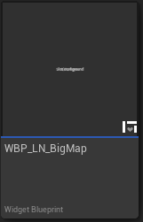
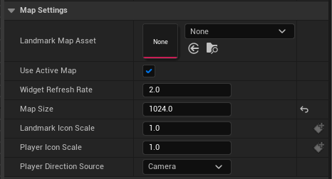
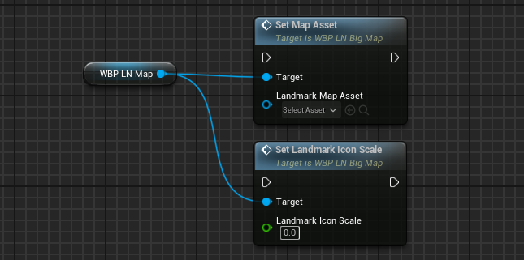

# BigMap (Widget)

The BigMap widget (`WBP_LN_BigMap`) is a UserWidget that displays landmarks in a top down fashion. However, in contrast with the [Minimap](Minimap){:target="blank"}, the BigMap will:
* Show the entire map all at once with all landmarks relevant to it
* Will always be displayed North up
* Have its map asset manually set 

Some additional BigMap settings are landmark specific, see [LandmarkAsset](LandmarkAsset){:target="blank"}.

 
#### Usage:  
* Add a WBP_LN_BigMap to your widget.
* Use the provided slots to customise the compass' visual appearance.
* Tweak its settings to customise the map's behaviour.

See Content/Demo/Widget/WBP_LN_Demo_BigMap, for an use example.

 
### Properties

| Property Name         | Description                                                                                                                                                                                    |
| --------------------- | ---------------------------------------------------------------------------------------------------------------------------------------------------------------------------------------------- |
| Landmark Map Asset    | The LandmarkMapAsset to display. (is ignored if bUseActiveMap is set to true).                                                                                                                 |
| bUseActiveMap         | If true, the big map will use which ever map asset was set as Active Map.                                                                                                                      |
| Widget Refresh Rate   | How often per seconds should we update the landmarks' position on the minimap. The more visible landmarks are the more expensive it gets to update all of them (Warning: affects performance). |
| Map Size              | The size of the minimap in pixels (default is 512).                                                                                                                                            |
| LandmarkIconScale     | The scale factor for landmark icons (default is 1.0)                                                                                                                                           |
| PlayerIconScale       | The scale factor for the player icon (default is 1.0)                                                                                                                                          |
| PlayerDirectionSource | If MapDirectionSource is set to North, choose the direction the player indicator should follow.                                                                                                |

### Functions

| Property Name        | Description                                                                                                                 |
| -------------------- | --------------------------------------------------------------------------------------------------------------------------- |
| SetMapAsset          | Sets the map asset to display.                                                                                              |
| SetLandmarkIconScale | Changes the scale of the landmark icons (useful if you implement a zoom function, this will help rescale icons on the map). |

