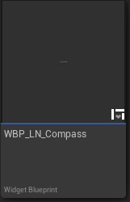
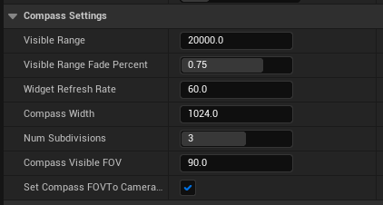
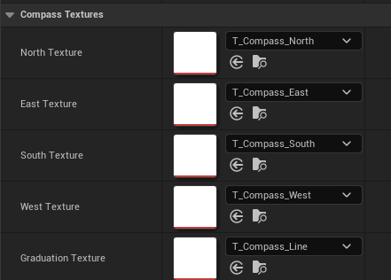

# Compass (Widget)

The Compass widget (`WBP_LN_Compass`) is a UserWidget designed to display cardinals point (North, East, South, West) and landmarks. Cardinals are calculated based on the 'North direction' setting (found in the plugin's [Settings](../Settings){:target="blank"}). 

Some additional compass settings are landmark specific, see [LandmarkAsset](LandmarkAsset){:target="blank"}.

 
#### Usage:  
* Add a WBP_LN_Compass to your widget.
* Use the provided slots to customise the compass' visual appearance.
* Tweak its settings to customise the compass' behaviour.

See Content/Demo/Widget/WBP_LN_Demo_Hud, for an use example.

 
### Properties

| Property Name                 | Description                                                                                                                                                                                    |
| ----------------------------- | ---------------------------------------------------------------------------------------------------------------------------------------------------------------------------------------------- |
| Visible Range                 | The distance beyond which landmarks should not be displayed on the compass (Warning: affects performance).                                                                                     |
| Visible Range Fade Percent    | The distance at which the landmark should start fading away (0% means always fading, 50% fading starts a 50% of the compass range)                                                             |
| Widget Refresh Rate           | How often per seconds should we update the landmarks' position on the compass. The more visible landmarks are the more expensive it gets to update all of them (Warning: affects performance). |
| Compass Width                 | The width in pixel of the compass.                                                                                                                                                             |
| Compass Height                | The height in pixel of the compass.                                                                                                                                                            |
| Num Subdivision               | The number of compass subdivisions to display (in between cardinals).                                                                                                                          |
| Compass Visible FOV           | The visible FOV in degrees of the compass (Warning: affects performance).                                                                                                                      |
| Set Compass FOV to Camera FOV | If true, the compass will be set to the camera's FOV (calculated when the compass is spawned). This overrides any value set to CompassVisibleFOV.                                              |

 
#### Textures

You can customise the look of the compass's cardinals by swapping these texture to custom ones.