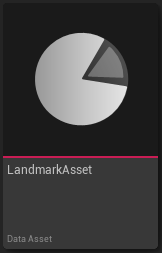
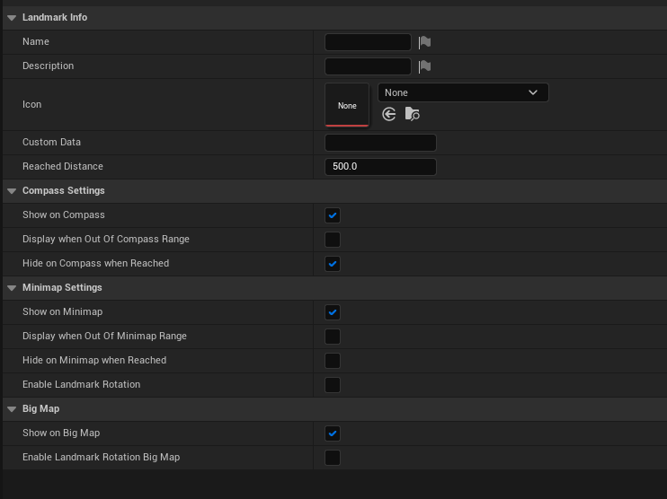

# Landmark Asset

A `ULandmarkAsset` is a Data Asset used to define a specific landmark and how it should behave on various LandmarkNavigation systems ([Minimap](../Entities/Minimap){:target="blank"}, [Compass](../Entities/Compass){:target="blank"} etc...).

Create `ULandmarkAsset` for each different landmarks you wish to have in your game and properly assign them to [`ULandmarkComponent`](LandmarkComponent){:target="blank"} in your actors.

 
#### Usage:  
* Create a `ULandmarkAsset`
* Assign it to a [`ULandmarkComponent`](LandmarkComponent){:target="blank"}, itself assigned to an actor
* Spawn the actor in the level. The landmark will be seen by LandmarkNavigation systems.

 
### Properties

#### Landmark Info

| Property Name    | Description                                                                                             |
| ---------------- | ------------------------------------------------------------------------------------------------------- |
| Name             | Name of the Landmark (Not used by LandmarkNavigation)                                                   |
| Description      | Description of the Landmark (Not used by LandmarkNavigation)                                            |
| Icon             | Texture to represent the landmark on the minimap, compass and waypoint widgets.                         |
| Custom Data      | Use this field if you need to save some extra data for your game logic (Not used by LandmarkNavigation) |
| Reached Distance | Controls how close to the landmark the player has to be to trigger the OnLandmarkReached event          |

#### Compass Settings

| Property Name                     | Description                                                                                                                     |
| --------------------------------- | ------------------------------------------------------------------------------------------------------------------------------- |
| Show On Compass                   | If true this object can be displayed on the compass                                                                             |
| Display when Out Of Compass Range | If true this object will be displayed even when it is not in the compass's visible distance range (ie: even when very far away) |
| Hide on Compass when Reached      | If true this object will be hidden on the compass when it is reached                                                            |

#### Minimap Settings

| Property Name                     | Description                                                                                                                     |
| --------------------------------- | ------------------------------------------------------------------------------------------------------------------------------- |
| Show On Minimap                   | If true this object can be displayed on the minimap                                                                             |
| Display when Out Of Minimap Range | If true this object will be displayed even when it is not in the minimap's visible distance range (ie: even when very far away) |
| Hide on Minimap when Reached      | If true this object will be hidden on the compass when it is reached                                                            |
| Enabled Landmark Rotation         | If true, the landmark icon on the minimap will rotate according to the landmark's world rotation                                |

#### BigMap Settings

| Property Name                     | Description                                                                                                                     |
| --------------------------------- | ------------------------------------------------------------------------------------------------------------------------------- |
| Show On BigMap                    | If true this object can be displayed on the minimap                                                                             |                                                        |
| Enabled Landmark Rotation         | If true, the landmark icon on the minimap will rotate according to the landmark's world rotation                                |

