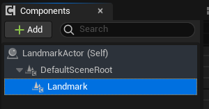
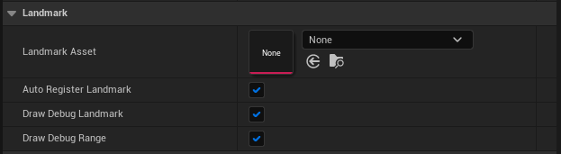
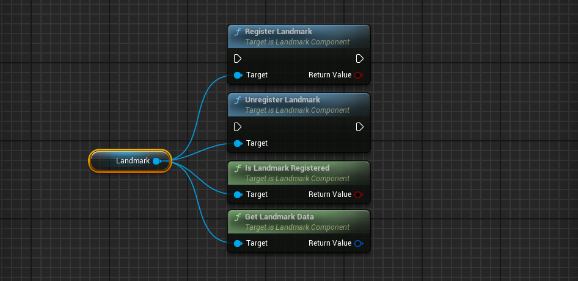
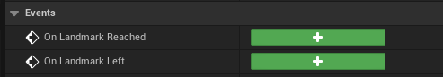

# Landmark Component

A `ULandmarkComponent`  is an ActorComponet that enables a landmark to exist and appear within the LandmarkNavigation systems  (minimap, compass etc...). In order to create a landmark you will need to add this component to an actor and assign it a [ULandmarkAsset](LandmarkAsset){:target="blank"}. Then if bAutoRegisterLandmark=true (or if you register it manually via RegisterLandmark()), this landmark will be available to all LandmarkNavigation's systems (minimap, compass etc...).  

 
#### Usage:  
* Attach this component to any actor that should appear on the minimap, compass etc...  
* Assign a ULandmarkAsset to this component.  
* Set bAutoRegisterLandmark to true OR manually register it via RegisterLandmark().  
*  Use the OnLandmarkReached or OnLandmarkLeft delegates to trigger gameplay events.

 
### Properties

| Property Name          | Description                                                                                                                                             |
| ---------------------- | ------------------------------------------------------------------------------------------------------------------------------------------------------- |
| Landmark Asset         | The [`ULandmarkAsset`](LandmarkAsset){:target="blank"} this component should be displayed as.                                                           |
| Auto Register Landmark | If true, this component will automatically register itself on BeginPlay. Otherwise, it needs to be manually registered via RegisterLandmark() function. |
| DrawDebugLandmark      | If true, will show the landmark's icon and range in the viewport. (Editor Only, disabled in builds).                                                    |
| DrawDebugRange         | If true, will show the landmark's range in the viewport. (Editor Only, disabled in builds).                                                             |

 
### Functions

| Function Name        | Description                                                                                                                                                                           |
| -------------------- | ------------------------------------------------------------------------------------------------------------------------------------------------------------------------------------- |
| RegisterLandmark     | Register/Enable this landmark. Allowing it to be ticked and seen by all LandmarkNavigation systems (ie: minimap, compass etc...).   You can revert this with UnregisterLandmark(). |
| UnregisterLandmark   | Unregister/Disable this landmark. This stops this landmark from ticking and being displayed.   You can revert this with RegisterLandmark().                                        |
| IsLandmarkRegistered | Returns whether this landmark component is registered to the LandmarkNavigation subsystem.                                                                                            |
| GetLandmarkData      | Returns this landmark's FLandmarkData (most up to date data used by LandmarkNavigation systems).                                                                                      |

 
### Events

| Event Name        | Description                                                                   |
| ----------------- | ----------------------------------------------------------------------------- |
| OnLandmarkReached | This events gets triggered whenever the user enters its ReachedRange.         |
| OnLandmarkLeft    | This events gets triggered whenever the user exits the range of the landmark. |
