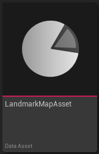
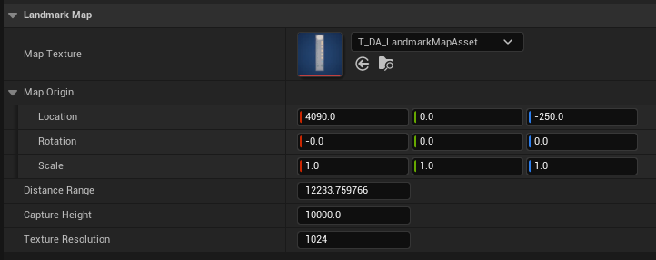

# Landmark Map Asset

A `ULandmarkMapAsset` is a Data Asset used to store the meta data associated to a Map Texture. It is necessary to properly render the map texture on the [Minimap](../Entities/Minimap){:target="blank"}. 
It also contains information required by the MapTool to easily edit/update existing map textures.

 
#### Usage:  
* Create a `ULandmarkMapAsset`
* Use it with the [MapTool](../MapTool){:target="blank"} to create a map texture
* Use SetActiveMapAsset() to activate the map asset during play

 
### Properties

| Property Name      | Description                                                                                                                                                              |
| ------------------ | ------------------------------------------------------------------------------------------------------------------------------------------------------------------------ |
| Map Texture        | Reference to the Texture Asset that was captured / to be rendered.                                                                                                       |
| Map Origin         | Transform of the LandmarkMapToolActor when texture was captured. This is also equivalent to the transformof the center of the map.                                       |
| Distance Range     | The distance in units from border to border on the map texture.                                                                                                          |
| Capture Height     | The camera height at which the map was captured. In practice this can be seen as a clipping height value (objects above this height will not be visible on the texture). |
| Texture Resolution | The resolution of the captured texture (only supports square (1:1) textures).                                                                                            |

