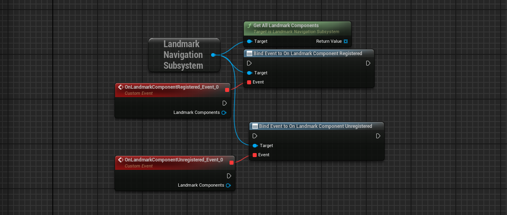
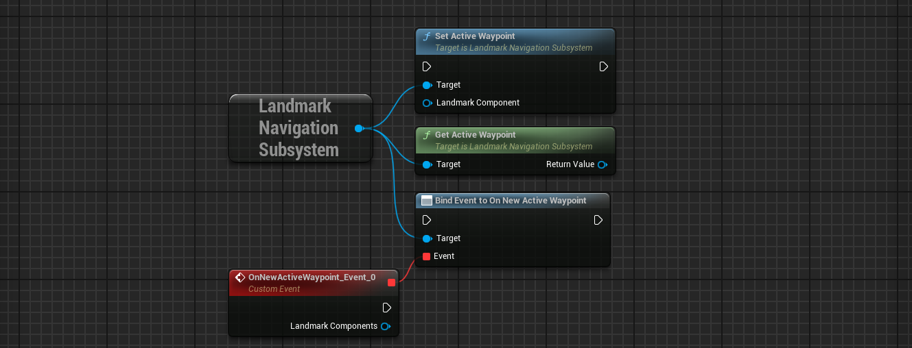
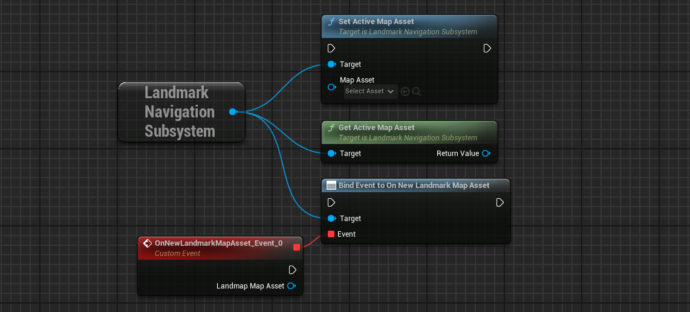
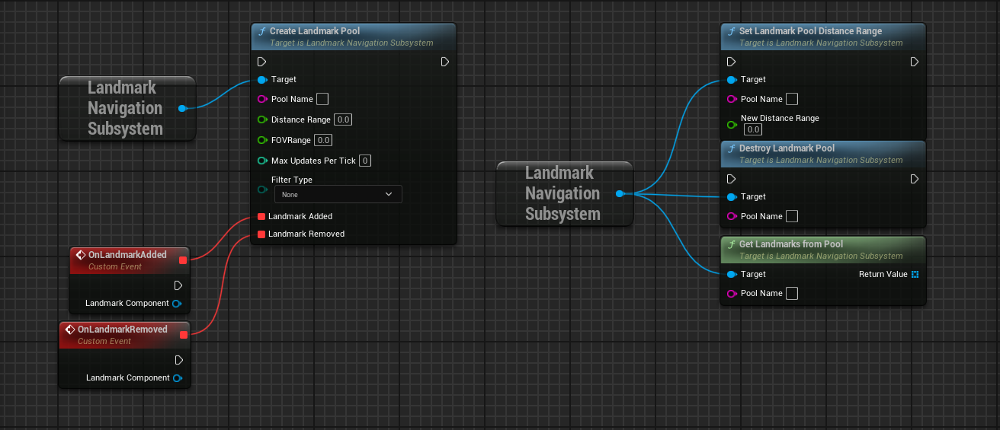

# Landmark Navigation Subsystem
 

The `ULandmarkNavigationSubsystem` is a world subsystem responsible for managing registered [`ULandmarkComponent`](LandmarkComponent){:target="blank"} in the world. It includes a distance-based tick rate system, allowing landmarks closer to the player to update more frequently than those further away. A landmark tick update will update the `FLandmarkData` member of a LandmarkComponent, which contains all the necessary data for LandmarkNavigation's system to work ([Minimap](../Entities/Minimap){:target="blank"}, [Compass](../Entities/Compass){:target="blank"} and [Waypoint](../Entities/Waypoint){:target="blank"}).

Some of its settings are exposed in the plugin's [settings](../Settings){:target="blank"}.

 
### General

| Name                            | Description                                            |
| ------------------------------- | ------------------------------------------------------ |
| GetAllLandmarkComponents        | Retrieves all currently registered landmarks.          |
| OnLandmarkComponentRegistered   | Triggers when a landmark is successfully registered.   |
| OnLandmarkComponentUnregistered | Triggers when a landmark is successfully unregistered. |

 
### Active Waypoint

| Name                | Description                                                                                                                                                                  |
| ------------------- | ---------------------------------------------------------------------------------------------------------------------------------------------------------------------------- |
| SetActiveWaypoint   | Set a [ULandmarkComponent](LandmarkComponent){:target="blank"} as active waypoint, meaning it should be displayed on the waypoint widget. There can only be one active map asset at any time. |
| GetActiveWaypoint   | Returns the currently Active Waypoint (LandmarkComponent) or nullptr if none.                                                                                                |
| OnNewActiveWaypoint | Triggers whenever a new ULandmarkComponent is set as waypoint.                                                                                                               |

 
### Active Map Asset

| Name                  | Description                                                                                                                                               |
| --------------------- | --------------------------------------------------------------------------------------------------------------------------------------------------------- |
| SetActiveMapAsset     | Set a [ULandmarkMapAsset](LandmarkMapAsset){:target="blank"} as active, meaning it should be displayed on the minimap. There can only be one active map asset at any time. |
| GetActiveMapAsset     | Returns the currently Active Map Asset or nullptr if none.                                                                                                |
| OnNewLandmarkMapAsset | Triggers whenever a new ULandmarkMapAsset is set as active.                                                                                               |

 
### Landmark Pools

Landmark Pools allows to filter through all registered landmarks based on specific filters. This allows Minimap and Compass widget to handle smaller quantity of landmarks on every tick, and is a crucial performance feature. Each pool can be retrieved via its 'Pool Name'. 
This system is already implemented in the [Minimap](Minimap){:target="blank"} and [Compass](Compass){:target="blank"} widgets.
**Only care to use these features if you wish to create your own systems.**

| Function Name                | Description                                                                                                                                                                                                                                                            |
| ---------------------------- | ---------------------------------------------------------------------------------------------------------------------------------------------------------------------------------------------------------------------------------------------------------------------- |
| CreateLandmarkPool           | Creates a named pool of landmarks. When the subsystem ticks, it will also evaluate each pool's filter conditions to see if the ticking landmark is relevant to this pool. Use the OnLandmarkAdded and OnLandmarkRemoved delegates to bind gameplay to pool changes. |
| SetLandmarkPoolDistanceRange | Sets the pool's Distance Range. Can be called during play (when zooming in/out on the minimap for example).                                                                                                                                                            |
| DestroyLandmarkPool          | Destroy a LandmarkPool by name.                                                                                                                                                                                                                                        |
| GetLandmarksFromPool         | Returns all the landmarks that are currently relevant to this pool.                                                                                                                                                                                                    |

