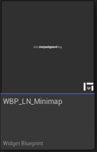
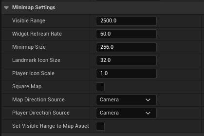
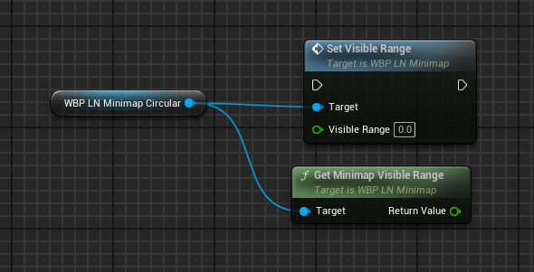

# Minimap (Widget)

The Minimap widget (`WBP_LN_Minimap`) is a UserWidget that displays landmarks in a top down fashion. By default the map will rotate based on the pawn or camera's direction. Optionally, the map can be fixed to the north direction, in which case it uses the 'North direction' setting (found in the plugin's [Settings](../Settings){:target="blank"}). 

Some additional minimap settings are landmark specific, see [LandmarkAsset](LandmarkAsset){:target="blank"}.

 
#### Usage:  
* Add a WBP_LN_Minimap to your widget.
* Use the provided slots to customise the compass' visual appearance.
* Tweak its settings to customise the minimap's behaviour.

See Content/Demo/Widget/WBP_LN_Demo_Hud, for an use example.

 
### Properties

| Property Name              | Description                                                                                                                                                                                    |
| -------------------------- | ---------------------------------------------------------------------------------------------------------------------------------------------------------------------------------------------- |
| Visible Range              | The visible range of the minimap (Warning: affects performance)..                                                                                                                              |
| Widget Refresh Rate        | How often per seconds should we update the landmarks' position on the minimap. The more visible landmarks are the more expensive it gets to update all of them (Warning: affects performance). |
| Minimap Size               | The size of the minimap in pixels (default is 512).                                                                                                                                            |
| LandmarkIconSize           | The size in pixels of the icons representing landmarks (default is 64)                                                                                                                         |
| PlayerIconScale            | The scale factor for the player icon (default is 1.0)                                                                                                                                          |
| bSquareMap                 | If true, the minimap will be displayed as a square.                                                                                                                                            |
| MapDirectionSource         | In what direction should the minimap be oriented in.                                                                                                                                           |
| PlayerDirectionSource      | If MapDirectionSource is set to North, choose the direction the player indicator should follow.                                                                                                |
| bSetVisibleRangeToMapAsset | If true, the visible range will be set to match that of the map asset (useful for fullescreenmaps, overrides VisibleRange value)                                                               |

### Functions

| Property Name          | Description                                                                 |
| ---------------------- | --------------------------------------------------------------------------- |
| SetVisibleRange        | Sets the visible range of the minimap (ie: Set's the zoom value of the map) |
| GetMinimapVisibleRange | Returns the current visible range.                                          |
