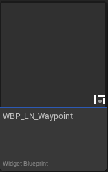

# Waypoint (Widget)

The Waypoint widget (`WBP_LN_Waypoint`) is a UserWidget that displays landmarks on the screen's 2D space. It is recommended to have the waypoint widget cover the entire screen.  

 
#### Usage:  
* Add a WBP_LN_Waypoint to your widget.
* Tweak its settings to customise the waypoint's behaviour.

See Content/Demo/Widget/WBP_LN_Demo_Hud, for an use example.

 
### Properties

| Property Name            | Description                                                                                                                                                                           |
| ------------------------ | ------------------------------------------------------------------------------------------------------------------------------------------------------------------------------------- |
| Waypoint Size            | The size in pixel of the waypoint landmark displayed on screen.                                                                                                                       |
| Waypoint Area Padding    | The padding size of the area in which the waypoint landmark can move (ie: how many pixels from the edge of the widget).                                                               |
| Clamp Waypoint To Screen | If true, the waypoint will be clamped to the edge of the widget.  If false, the waypoint will be allowed to disappear offscreen, only appearing when it is in front of the player. |
