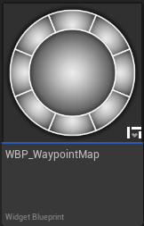
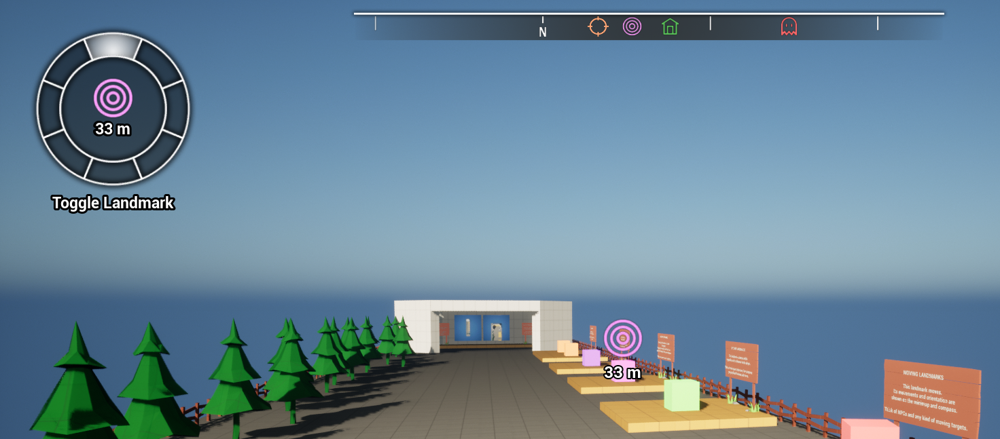
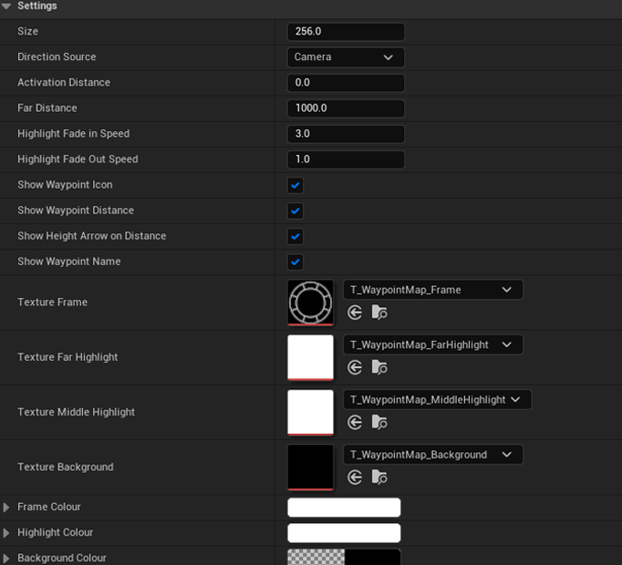

# Waypoint Map (Widget)

The WaypointMap widget (`WBP_LN_WaypointMap`) is a UserWidget that displays a cursor showing the direction to the currently active  [Waypoint](Waypoint) similarly to a real compass indicating the North direction. This widget can optionally display information about the active waypoint. It will also automatically appear / disappear when a waypoint is enabled / disabled. 

 

 

#### Usage:  
* Add a WBP_LN_WaypointMap to your HUD widget.
* Tweak its settings to customise the waypoint's behaviour.
* The widget will appear if a landmark is set as Active Waypoint.

 

See  [LandmarkNavigationSubsystem](LandmarkNavigationSubsystem) for all waypoint related functions.

See Content/Demo/Widget/WBP_LN_Demo_Hud, for an use example.

 

### Properties

| Property Name             | Description                                                                                                                                                                           |
| ------------------------- | ------------------------------------------------------------------------------------------------------------------------------------------------------------------------------------- |
| Size                      | The size of the widget in pixels.                                                                                                                                                     |
| DirectionSource           | If the distance to the waypoint is above this value, this widget should disappear (if <0 the widget is always be shown).                                                              |
| ActivationDistance        | If true, the waypoint will be clamped to the edge of the widget.  If false, the waypoint will be allowed to disappear offscreen, only appearing when it is in front of the player. |
| FarDistance               | The distance below which the central highlight texture should be activated. Otherwise the outer pieces will show the direction towards the waypoint.                                  |
| HighlightFadeInSpeed      | The speed at which the outer direction pieces should appear.                                                                                                                          |
| HighlightFadeOutSpeed     | The speed at which the outer direction pieces should disappear.                                                                                                                       |
| ShowWaypointIcon          | If true, the widget will show the Waypoint's landmark icon in its center.                                                                                                             |
| ShowWaypointDistance      | If true, the widget will show the distance to the Waypoint in its center.                                                                                                             |
| ShowHeightArrowOnDistance | If true an arrow will be displayed showing whether the waypoint is above or below the player.                                                                                         |
| ShowWaypointName          | If true, the name of the waypoint will be displayed underneath this widget.                                                                                                           |
| Texture_Frame             | Texture used as the frame of the widget (white outlines).                                                                                                                             |
| Texture_FarHighlight      | Texture used as the outer pieces that show the direction towards the waypoint.                                                                                                        |
| Texture_MiddleHighlight   | Texture used as central highlight (if the waypoint is near the player).                                                                                                               |
| FrameColour               | Frame texture colour and opacity.                                                                                                                                                     |
| HighlightColour           | Far and Middle highlight colour and opacity.                                                                                                                                          |
| BackgroundColour          | Background texture colour and opacity.                                                                                                                                                |
