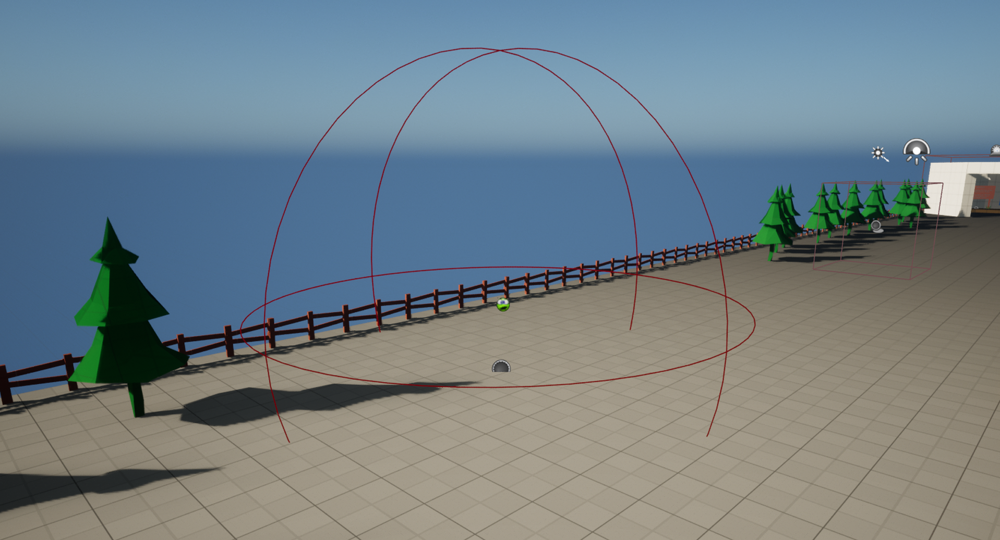
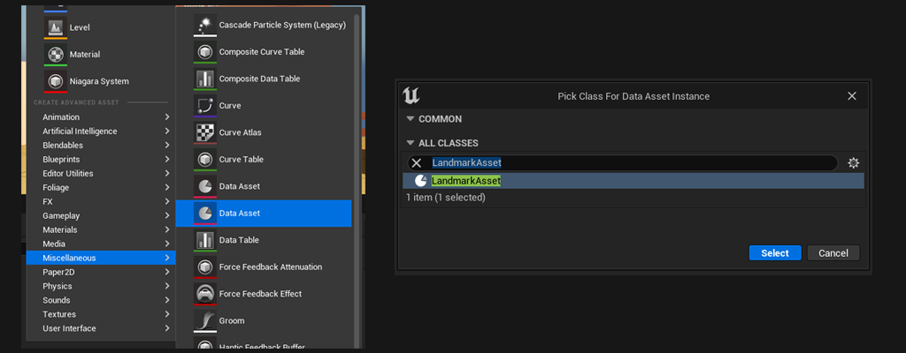
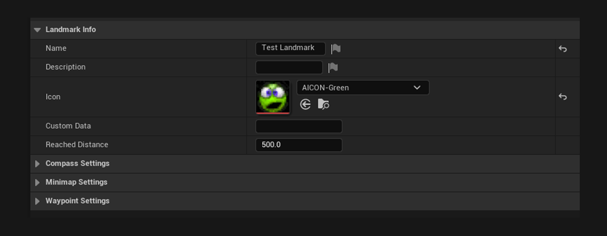
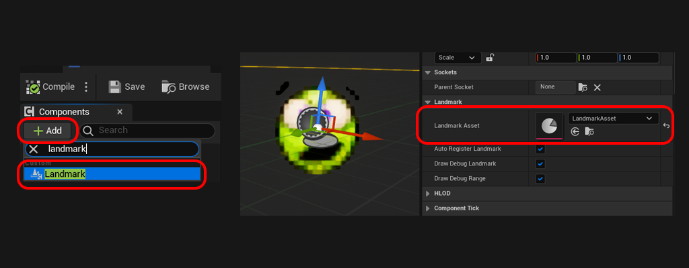

# Creating Landmarks
 

This initial guide will walk you through the fundamental steps required to define a [LandmarkAsset](../Entities/LandmarkAsset){:target="blank"} and assign it to a [LandmarkComponent](../Entities/LandmarkComponent){:target="blank"}. By the end of this tutorial, you will have the basics to start displaying things on the [Minimap](../Entities/Minimap){:target="blank"} and [Compass](../Entities/Compass){:target="blank"} widgets.

 

***

## Step 1: Create a Landmark Asset

The foundation of any landmark in this system is the [LandmarkAsset](../Entities/LandmarkAsset){:target="blank"}. This is a type of Data Asset that holds the basic information that defines a landamark and its behaviour on the minimap, compass and waypoint.

 
#### Steps:
1. Navigate to your Content Browser. 
2. Right-click, under 'Miscellaneous' select Data Asset.
3. Search and select 'LandmarkAsset'.

***

## Step 2: Configure the Landmark Asset

With the LandmarkAsset created, we can start looking at the information it holds. This is where we will configure how the landmark's appearance and behaviour.

 
#### Steps:
1. Open the LandmarkAsset you have just created.
2. Set its icon to something recognisable.

For more information about the other properties check out: [LandmarkAsset](../Entities/LandmarkAsset){:target="blank"}.

***

## Step 3: Setup a Landmark Component

For our landmark to have a location in the world, we need to assign it to a [LandmarkComponent](../Entities/LandmarkComponent){:target="blank"}, an actor component you can add to any actor you need to see on the minimap and compass.

 
#### Steps:
1. Create a new Actor blueprint OR open an existing actor blueprint.
2. Add a LandmarkComponent to this actor.
3. Select the LandmarkComponent and in the 'LandmarkAsset' field, pick the LandmarkAsset you have created in Step 1.

With this setup you should now be able to see the landmark icon and its range (represented by a red debug sphere). 

***

With these steps you now have a landmark ready to use! As soon as the actor is spawned in the level, it will be ready to display on the Minimap, Compass and Waypoint widgets. 
Check out how to setup these widgets here: [Setup Minimap & Compass](2_WidgetSetup){:target="blank"}