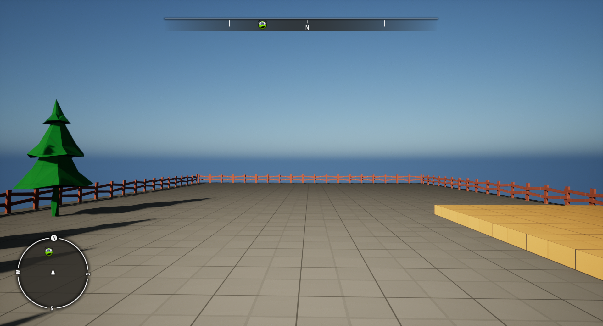
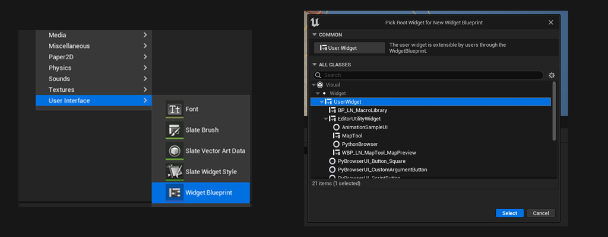
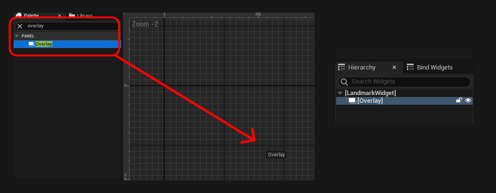
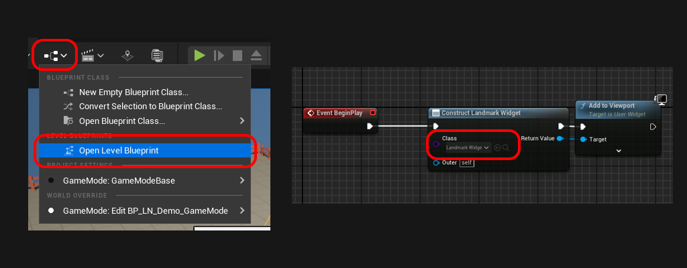
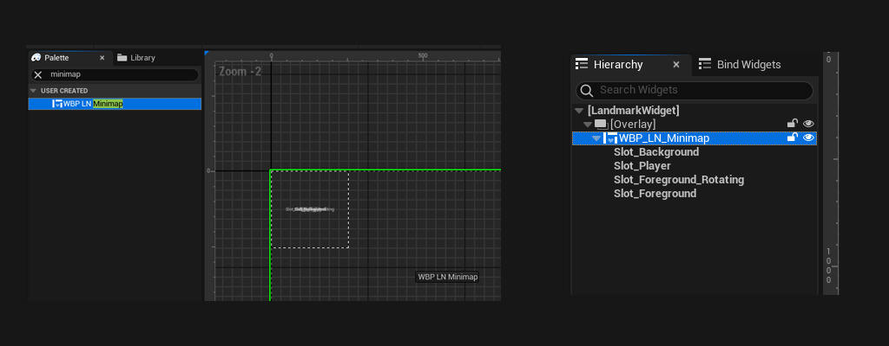
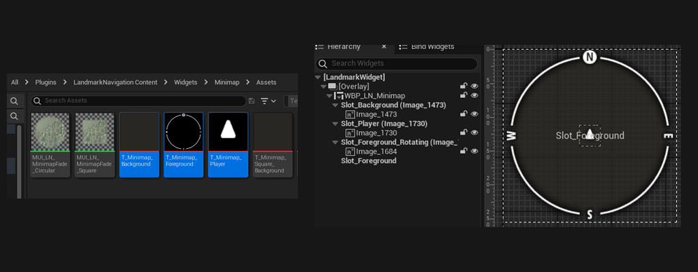
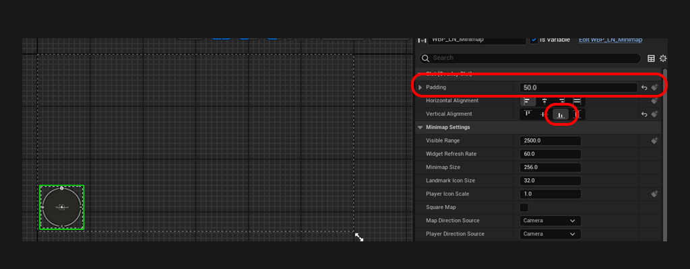
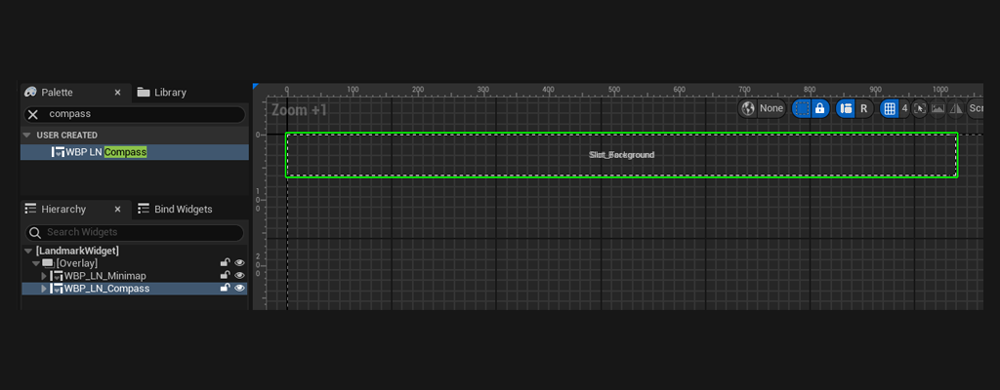
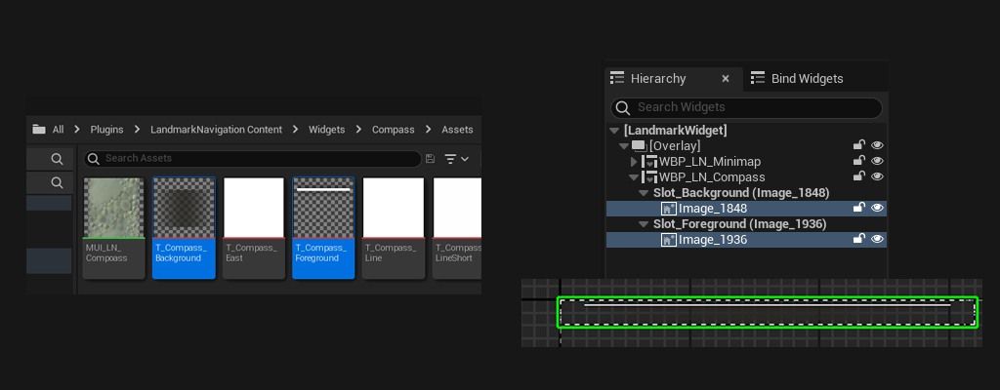
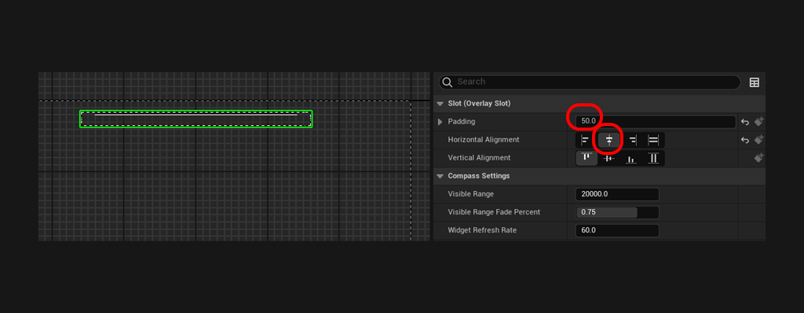

# Setup Minimap & Compass
 

In this tutorial, we will see how to set up the Minimap and Compass widgets. By the end of this tutorial you will have the simplest setup to view the any landmarks spawned in the level via the [Minimap](../Entities/Minimap){:target="blank"} and [Compass](../Entities/Compass){:target="blank"}.

 

***

## Step 1: Create a HUD widget

We will create a widget that will hold both the minimap and compass widgets. This will allow us to have a central place to edit both. Feel free to skip this step if you already have a HUD widget. Please note, that we recommend using an Overlay panel as parent to LandmarkNavigation widgets.  

 
#### Steps:
1. In the Content Browser, right-click and under 'User Interface' pick Widget Blueprint.
2. When prompted select UserWidget as the parent class.

	

3. Open the newly created widget and search for `Overlay` in the Palette. Drag and drop it in the hierarchy. We will be parenting our widgets to this overlay.
	

4. Open the Level blueprint. On the `OnBeginPlay` event, add the `ConstructObject` and `AddToViewport` nodes to create your widget and display it on screen. *Please note that on the long term you might not want to initialise the widget in the level blueprint.*

	

***

## Step 2: Setting up the Minimap
We will add and setup a [Minimap](../Entities/Minimap){:target="blank"} widget in our HUD Widget. By default, the minimap is circular, we won't cover square maps in this tutorial. Feel free to check how it is setup checkout the demo HUD widget: `Plugins/LandmarkNavigation/Content/Demo/Widgets/WBP_LN_Demo_Hud`.

 
#### Steps:
1. Open the HUD widget we created in Step 1
2. Search for the `WBP_LN_Minimap` widget, drag and drop it into the Overlay Panel.
3. Expand the newly created `WBP_LN_Minimap` and see the different slots it holds.  Each slot accepts up to 1 child, we use them to customise the visual appearance of our minimap.
	

4. For the purpose of this tutorial we'll use the textures included with plugin (see texture assets in `Plugins/LandmarkNavigation/Content/Widgets/Minimap/Assets`). Feel free to export them and customise them. Drag and drop the textures onto the corresponding slot:

	**Slot_Background:** `T_Minimap_Background`   
	**Slot_Player:** `T_Minimap_Player`   
	**Slot_Foreground_Rotating:** `T_Minimap_Foreground`   
	

5. Set the Vertical Alignement to Bottom, and set the padding to 50. This should allow the minimap to sit nicely in the bottom left of the HUD.
	

With this setup, the minimap is already functional, hit play and see it for yourself (ensure the landmark actor is in the level).   
You can also tweak the settings according to your gameplay directly onto the minimap widget you added. Simply select it and check the details panel. For more information on each setting available see: [Minimap](../Entities/Minimap){:target="blank"}.

***

## Step 3: Setting up the Compass
We will add and setup a [Compass](../Entities/Compass){:target="blank"} widget in our HUD Widget. Feel free to check how it is setup in the demo HUD widget: `Plugins/LandmarkNavigation/Content/Demo/Widgets/WBP_LN_Demo_Hud`.

 
#### Steps:
1. Open the HUD widget we created in Step 1
2. Search for the `WBP_LN_Compass` widget, drag and drop it into the Overlay Panel.
3. Expand the newly created `WBP_LN_Compass` and see the different slots it holds.  Each slot accepts up to 1 child, we use them to customise the visual appearance of our minimap.
	

4. For the purpose of this tutorial we'll use the textures included with plugin (see texture assets in `Plugins/LandmarkNavigation/Content/Widgets/Compass/Assets`). Feel free to export them and customise them. Drag and drop the textures onto the corresponding slot:

	**Slot_Background:** `T_Compass_Background`   
	**Slot_Foreground:** `T_Compass_Foreground`   
	

5. Set the Horizontal Alignement to Center, and set the padding to 50. This should allow the compass to sit nicely in the top center of the HUD.
	

With this setup, the compass is already functional, hit play and see it for yourself (ensure the landmark actor is in the level).   
You can also tweak the settings according to your gameplay directly onto the compass widget you added. Simply select it and check the details panel. For more information on each setting available see: [Compass](../Entities/Compass){:target="blank"}.

***

If you've followed the [first tutorial](1_CreatingLandmarks){:target="blank"}, place the actor containing the landmark in the scene and hit play. You should already be able to see the landmark on the minimap and compass.
Next, check out how to create Map textures: [Creating Map Assets](3_CreatingMapAsset){:target="blank"}
