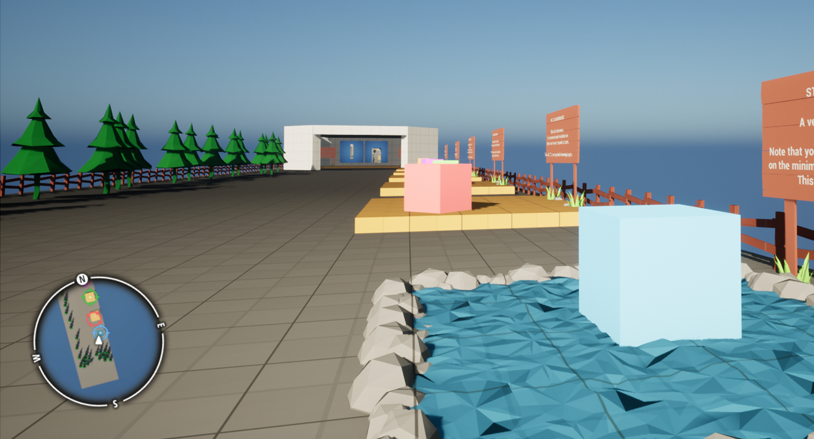
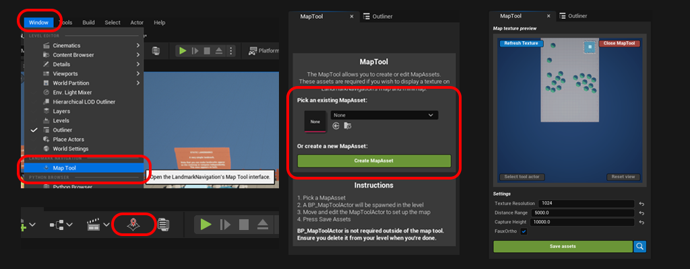
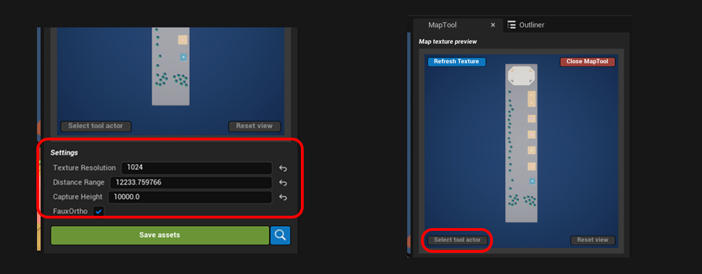
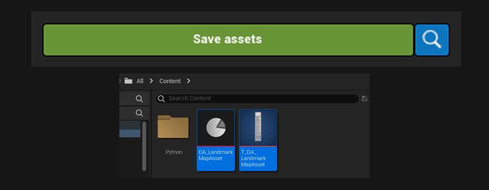
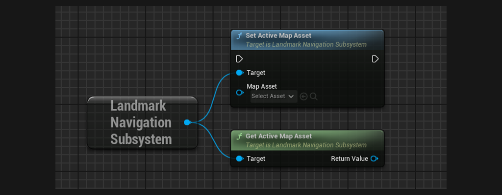
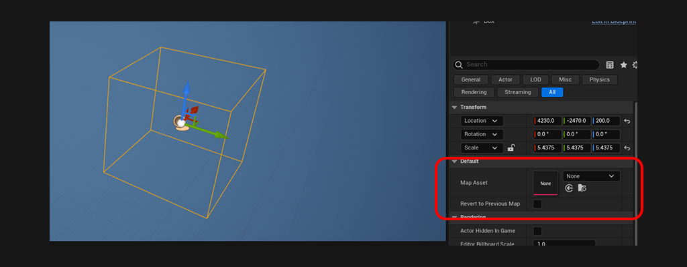

# Creating Map Assets
 

In this tutorial, we will see how to create a map texture with the [Map Tool](../MapTool){:target="blank"} to display on the [Minimap](../Entities/Minimap){:target="blank"} widget. We will also go over changing map texture during play, for example to change the map when the player enters an indoor area.

 

***

## Step 1: Using the MapTool

The LandmarkNavigation plugin comes with an editor tool, the [Map Tool](../MapTool){:target="blank"}. For more detailed information on the Map Tool refer to its documentation page.

 
#### Steps:
1. Open the MapTool via the toolbar button or via `Window -> LandmarkNavigation -> MapTool`.
2. If you have not yet created a [LandmarkMapAsset](../Entities/LandmarkMapAsset){:target="blank"}, create one via the MapTol (with the Create MapAsset button). Else pick the map asset you wish to edit. With a valid MapAsset, the tool will spawn a `LandmarkMapToolActor`, show the map render.

3. Move the spawned `LandmarkMapToolActor` in the level and adjust the settings from the MapTool itself to frame the rendering. The map preview will show exactly how the resulting map texture will look like.  
	

4. Once you're happy with the way the map texture looks, hit 'Save Assets'. You can then press the magnifying glass button to navigate to the created asset in the Content Browser.
	

***

## Step 2: Using the Map Asset
The [LandmarkNavigationSubsystem](../Entities/LandmarkNavigationSubsystem){:target="blank"} keeps track of the Active Map asset, and updates the minimap widgets accordingly. There can only be one ActiveMapAsset at any given time, however you can change it on the fly.

#### Using blueprints:

#### Using BP_LN_MapSwitcher:

This blueprint is an example of how to use map assets. It will switch map assets whenever the player enters the box. Optionally reverting to the previous map assets (enabled RevertToPreviousMap bool).