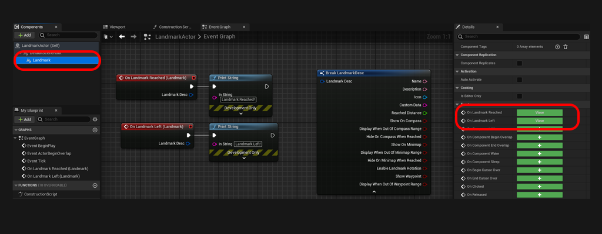
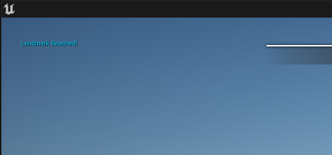
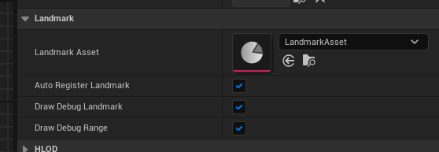
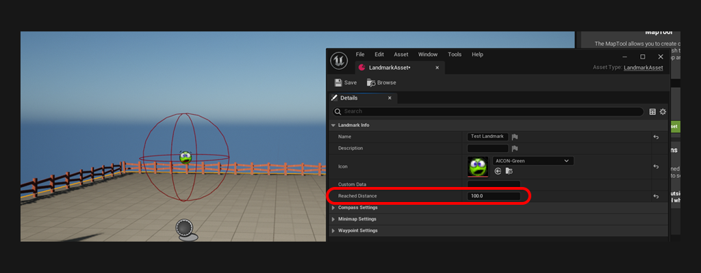

# Setup Landmark events
 

One crucial functionality of a landmark is to detect whether the user is in range (has he reached the objective?). In this tutorial, we will see how to listen to these events. 
 

***

## Step 1: Landmark Events

 
1. Open the actor containing the LandmarkComponent
2. Select the LandmarkComponent and in the details panel, scroll down until you see the events. See `OnLandmarkReached` and `OnLandmarkLeft`.
	

3. For this tutorial, I have added a Print String to the `OnLandmarkReached` event. Now if I play and go near the landmark: 
    

***

## Step 2: Changing the range

 
1. Ensure `DrawDebugRange` is enabled on the LandmarkComponent. Now the range of the landmark is rendered with a red debug sphere around the landmark.
	
2. Open the LandmarkAsset, and change the `ReachedDistrance` value. You will see the red debug sphere get resized accordingly. 
	