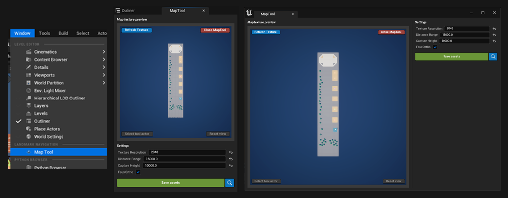
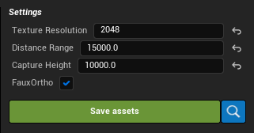

# Map Tool
 

The MapTool is a in-editor interface that will help to create map textures to use with LandmarkNavigation's widget. It works by using [LandmarkMapAssets](Entities/LandmarkMapAsset){:target="blank"} which will hold information about the map capture (necessary for the map to properly render on the map widgets). 

The map tool relies on an actor (the LandmarkMapToolActor) that is spawned when a map asset is selected, and contains a SceneCaptureComponent. Textures a render in top-down, orthographic fashion. 

 
#### Usage:
1. Open the MapTool.
2. Create or pick an existing LandmarkMapAsset. This will create a LandmarkMapToolActor.
3. Move the LandmarkMapToolActor and frame the map texture by looking at the preview display. Use the settings to zoom in/out and set the texture resolution.
4. Hit 'Save assets'. This will create a texture next to the data asset you're editing.
5. Hit 'Close MapTool' to reset the map tool and delete the spawned LandmarkMapToolActor.

See [Creating Map Assets](GettingStarted/3_CreatingMapAsset){:target="blank"} for a tutorial on how to use it.

 
### Settings

| Name                                      | Description                                                                                                                                                                                                        |
| ----------------------------------------- | ------------------------------------------------------------------------------------------------------------------------------------------------------------------------------------------------------------------ |
| Texture Resolution                        | The resolution of the map texture to generate (max size is 4096).                                                                                                                                                  |
| Distance Range                            | The distance in units from border to border (how much distance should be rendered on the texture).                                                                                                                 |
| Capture Height                            | This is the height at which the texture is rendered. Use it as a near clipping plane value (any object above this height will not be rendered).                                                                    |
| FauxOrtho                                 | (Only available in UE 5.3 and below) Another way to render an orthographic perspective. Might help render some items that don't appear otherwise.                                                                  |
|  | Saves the captured map asset and updates the LandmarkMapAsset with a texture ref and capture settings. If a texture already exists, the map tool will rename the existing texture and create a new one next to it. |
|  | Opens the content browser and browse to the LandmarkMapAsset being edited.                                                                                                                                         |
