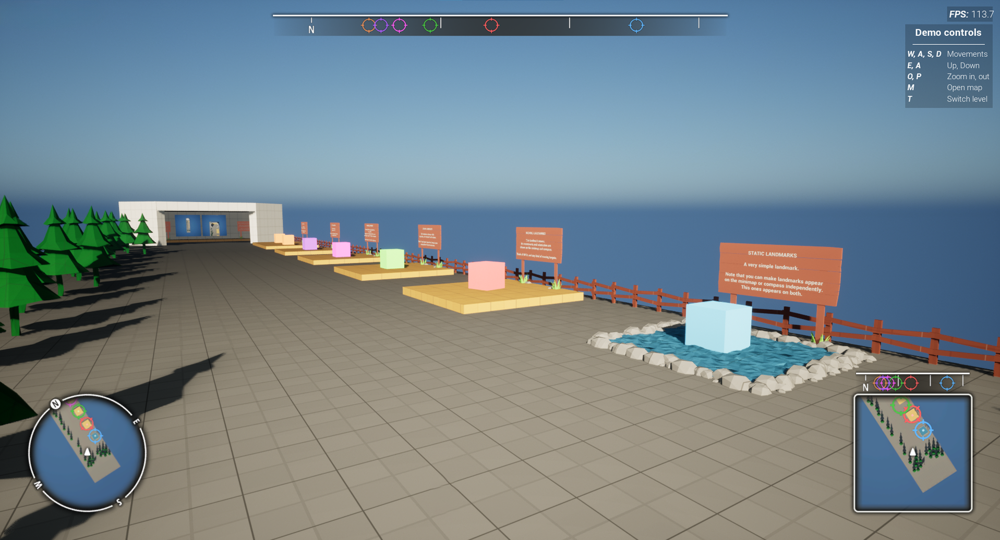
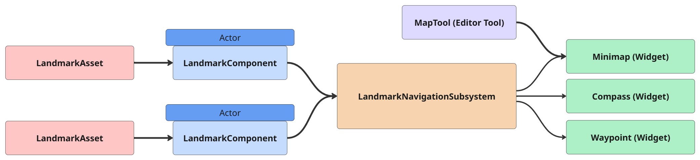

# Overview
 

 

Landmark Navigation is an Unreal Engine plugin that aims at bringing you a very simple and easy way to implement a map, compass and waypoint system in your game. You can consider it as one of the first brick to build upon your games as it includes several pre-built widget that are ready to use and fully customisable.

 
#### Features
* **Minimap:** A customisable widget to render landmarks on a circular or square minimap.
* **Compass:** A customisable widget that renders landmarks on an horizontal axis.
* **Waypoint:** A pre-build widget that renders landmarks on-screen in 2D space.
* **BigMap:** A pre-built widget that renders the entire map and all its landmarks.
* **MapTool:** An editor tool to help you create map textures that are ready to use with the minimap.
* **LandmarkNavigationSubsystem:** The brains of it all, handles all landmarks in the level and optimises them based on their distance to the player.
   
 
#### Technical Overview
 
 
* [**LandmarkAssets**](Entities/LandmarkAsset){:target="blank"} define a single landmark, its appearance and its behaviour.
* [**LandmarkComponents**](Entities/LandmarkComponent){:target="blank"} are assigned LandmarkAssets, a get registered to the LandmarkNavigationSubsystem.
* The [**LandmarkNavigationSubsystem**](Entities/LandmarkNavigationSubsystem){:target="blank"} handles all landmarks and prepares the relevant data for the various systems that needs it.
* The [**Minimap**](Entities/Minimap){:target="blank"}, [**Compass**](Entities/Compass){:target="blank"} and [**Waypoint**](Entities/Waypoint){:target="blank"} widgets retrieve this data from the subsystem and display their relevant landmarks on the HUD.
* The [**MapTool**](MapTool/Index){:target="blank"} will aid in generating map textures to use on the minimap widget.

***

**Have a look at the [Getting Started](GettingStarted/1_CreatingLandmarks){:target="blank"} section for instructions on how to setup the plugin.**