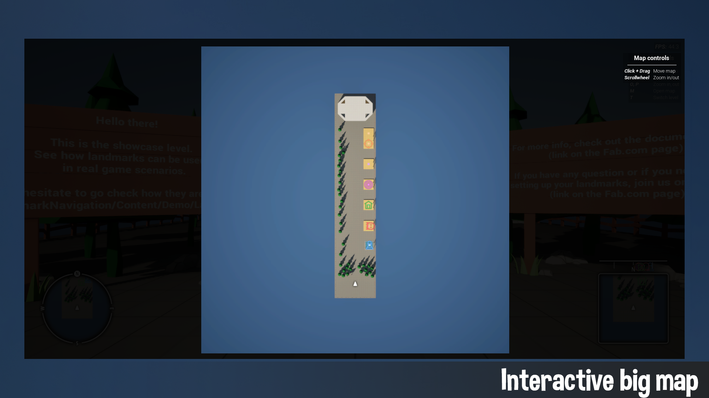

# Landmark Navigation
 

***

Description
:  Quick and easy minimap and compass system with a map texture generator.

Supported Version
: 
[5.0](){: .btn .btn-green}
[5.1](){: .btn .btn-green}
[5.2](){: .btn .btn-green}
[5.3](){: .btn .btn-green}
[5.4](){: .btn .btn-green}
[5.5](){: .btn .btn-green}
[5.6](){: .btn .btn-green}

Showcase video
: https://www.youtube.com/watch?v=-7-J9FiN0kY

Fab Marketplace
: https://www.fab.com/listings/e19bcb7f-995f-4fa0-bea6-290a39cdd373

Discord
: [https://discord.com/invite/bxgtNY8](https://discord.com/invite/bxgtNY8){:target="_blank"}

Unreal Forums
: https://forums.unrealengine.com/t/lambda-works-landmark-navigation/2542562

***

