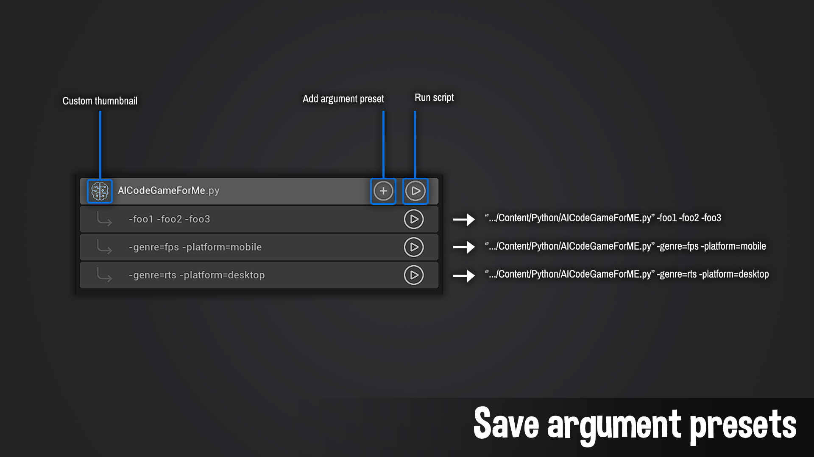

# Custom Arguments
 

If you need to call your python scripts with specific arguments you can also create ‘Custom Arguments’ presets. Presets are specific to a python file.  

 

 

## How To:

1. Press the ‘Add custom argument’ button. 

2. Fill in the newly created entry with the arguments you need.  

3.  Run the custom argument entry with the ‘Run with argument’ button.  

4. Delete the custom argument entry with the ‘Remove custom argument’ button.

***

## Saving Arguments

All custom argument presets are saved in the plugin’s settings accessible via the Settings button or in `Project/Config/DefaultPythonBrowser.ini.`

 

