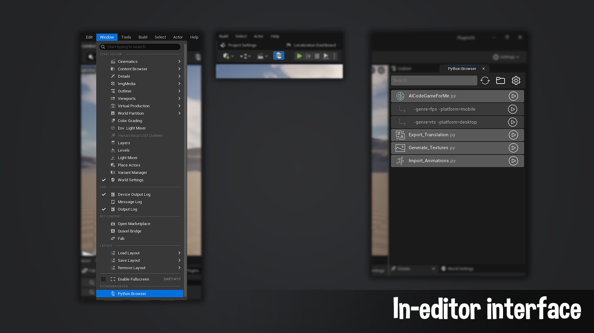

# Overview
 

Python Browser is an Unreal Engine plugin that allows you to quickly browse all the python scripts and run them straight from the editor.  The tool streamlines script execution by enabling users to create presets for specific arguments, eliminating the need to manually input them each time. This is an editor only tool meaning it won’t affect your packaged build.

***

## How to open

- Open Python Browser via the toolbar icon (can be disabled in settings).
- Navigate to Window -> Python Browser in the editor.

***

## Features

- Python Scripts: Instantly view all available scripts.
- Search: Search bar to filter through all the available scripts.
- Custom Argument Presets:  Save frequently used script parameters.

  
By default, Python scripts stored in the Project/Content/Python directory will automatically appear in the browser list. The search path can be customized in the plugin settings. Scripts run as they would through the OutputLog, ensuring full compatibility with Unreal's Python API and logging outputs.
