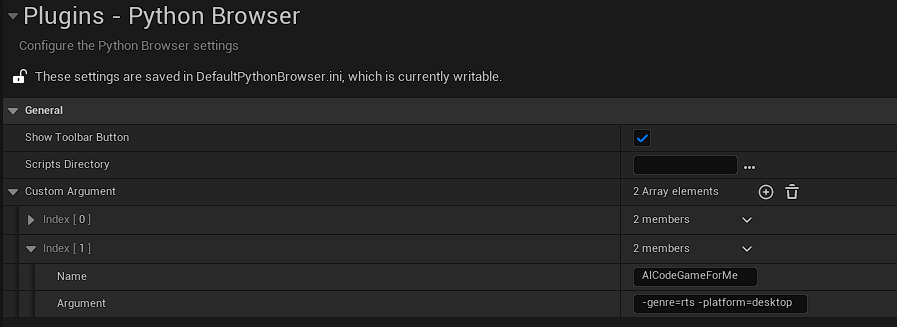

# Settings
 

The settings in Python Browser are about as simple as it can get. You will find them in `Project Settings -> Python Browser`, and are saved in `Project/Config/DefaultPythonBrowser.ini`.

 

  

 

Show Toolbar Button
: Enables or disables the button in the main window’s toolbar.

Scripts Directory
: An optional override of the path Python Browser uses to search for python scripts. By default it is blank, meaning the plugin will look in the default python location: Project/Content/Python. This field also supports paths relative to the editor’s .exe (situated in Engine/Binaries/Win64).  

Custom Arguments
: This list represents all the custom argument presets that have been created via the Python Browser widget.**