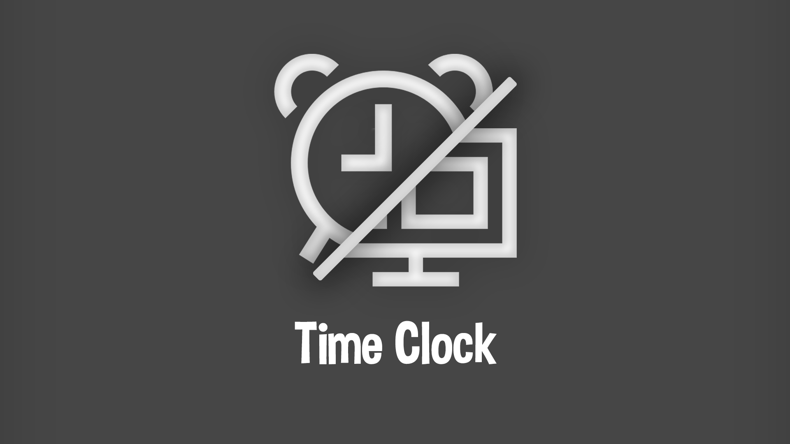
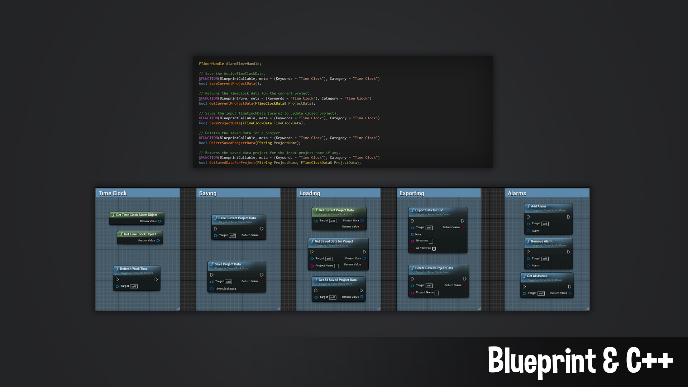

# Time Clock
 

***

Description
:  Easily track how long you've work in a project, and manage your times with alarms.

Supported Version
: 
[4.24](){: .btn .btn-green}
[4.25](){: .btn .btn-green}
[4.26](){: .btn .btn-green}
[4.27](){: .btn .btn-green}
[5.0](){: .btn .btn-green}
[5.1](){: .btn .btn-green}
[5.2](){: .btn .btn-green}
[5.3](){: .btn .btn-green}
[5.4](){: .btn .btn-green}
[5.5](){: .btn .btn-green}
[5.6](){: .btn .btn-red}

Github
: [https://github.com/Lambda-W/TimeClock](https://github.com/Lambda-W/TimeClock){:target="_blank"}

Fab Marketplace
:  [https://www.fab.com/listings/ae2e2112-46dd-43c4-93c8-81a690338571](https://www.fab.com/listings/ae2e2112-46dd-43c4-93c8-81a690338571){:target="_blank"}

Discord
: [https://discord.com/invite/bxgtNY8](https://discord.com/invite/bxgtNY8){:target="_blank"}

***

